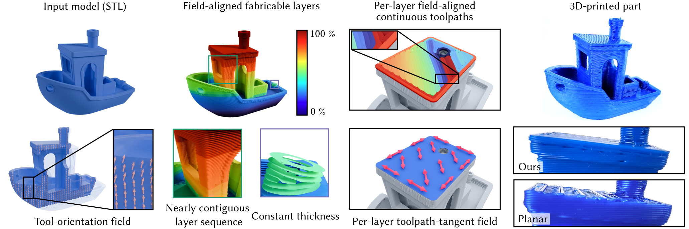

# AtomSlicer

This repository contains the reference implementation of **AtomSlicer: Constant-Thickness Field-Aligned Non-Planar Slicing and Continuous Toolpaths for FFF**.
For more details, refer to the [project page](https://xavierchermain.github.io/publications/atom-slicer).




## Replicability

This code has received the Graphics replicability stamp.

[](http://www.replicabilitystamp.org#https-github-com-iota97-atomslicer)


## Building

The project relies solely on the C++17 standard library. This makes the build process straightforward.

### Unix-like systems

Run the following commands:

```
mkdir build && cd build
cmake ..
make -j8
```

### Windows

Create a folder named `build` and run CMake as on Unix-like systems. Then, open the generated solution with Visual Studio and compile it. 
Precompiled binaries are also available [here](https://github.com/iota97/AtomSlicer/releases).

## Running the Code

Run the program from the `build` folder using the following command:
```
./slicer [mesh.stl] <options>
```
where the options are:
```
[-d nozzle_diameter] : Nozzle diameter in mm  [default: 0.6]
[-h layer_height_factor] : Ratio between layer height and nozzle width [default: 0.5]
[-t top_tilt_angle] : Maximum tilting angle for top surfaces in degrees [default: 30]
[-b bottom_tilt_angle] : Maximum tilting angle for bottom surfaces in degrees [default: 2]
[-3 3axis.gcode] : 3-axis GCode path, the normals are still provided in a comment on each line
[-5 5axis.gcode] : 5-axis GCode path, for the 3Z kinematics RatRig
[-p toolpath.ply] : Toolpath as PLY polyline
[-i infill_type] : Infill type:
    0 -> Full
    1 -> Hollow
    2 -> Grid
    3 -> Cubic
    4 -> Gyroid [default]
[-o tool_orientation] : Objective for the tool orientation:
    0 -> Conformal, smoothly interpolated
    1 -> Conformal on top and bottom surfaces, planar otherwise [default]
    2 -> Support free
    3 -> Oriented as the closest conformal surface
[-u user_defined] : Hard-coded direction field for specific models:
    0 -> None [default]
    1 -> Dragon tool orientations (Fig. 19)
    2 -> Airfoil tangents (Fig. 30)
    3 -> House tangents (Fig. 31)
[-c number_of_cover] : Number of covers for the conformal on top and bottom surfaces objective [default: 4]
[-z zigzag_offset] : Zigzag direction offset [default: 0]
[-C collision_angle] : Cone angle for nozzle collision detection [default: 95]
[-U] : Force partitioning collision check to use upward normal, useful for 3-axis printing
[-H] : Experimental perimeter hole closing, may cause collisions.
```
## Reproducing the Results

To reproduce the dragon shown in **Figure 20**, run the following command:

```
./slicer ../data/models/dragon.stl -o 2 -t 30.0 -b 30.0 -3 ../data/gcodes/dragon.gcode -p ../data/toolpaths/dragon.ply -d 0.6
```

The resulting toolpath can be opened using a G-code visualizer, such as [Craftware](https://help.craftbot.com/craftware/craftware-legacy/). Alternatively, the polyline toolpath in PLY format can be opened using a 3D modeling software such as [Blender](https://www.blender.org/).

To slice all the models in **Figure 16**, run the script `slice_all.sh` from the root folder of the repository. This may take several hours.

## Citation

If you use this code, please cite:

```
@article{Cocco2026AtomSlicer,
  author = {Cocco, Giovanni and Belle, Vincent and Garner, Eric and Lefebvre, Sylvain and Chermain, Xavier},
  title = {AtomSlicer: Constant-Thickness Field-Aligned Non-Planar Slicing and Continuous Toolpaths for FFF},
  year = {2026},
  doi = {10.1145/3811363},
  journal = {ACM Transactions on Graphics (Proceedings of SIGGRAPH)},
  volume = {45},
  number = {4},
  articleno = {58},
}
```

## Disclaimer

Although the software is designed to avoid collisions, collision-free operation cannot be guaranteed for every setup and printer configuration. Incorrect toolpaths or unforeseen interactions may result in collisions between the printer carriage and the print, potentially damaging your printer. We take no responsibility for any damage, hardware failure, or print failure caused by the use of this software. Users should closely supervise the printer at all times while printing.

## License

The source code of this project is provided under the MIT License. See
[LICENSE](LICENSE) for more details.